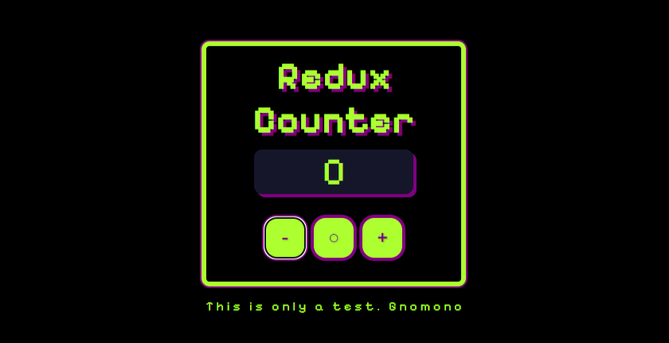

## Dependencias

    npm i redux
    npm i webpack webpack-cli
    npm i -D webpack-dev-server
    npm i --save-dev babel-loader @babel/core @babel/preset-env
    npm i --save-dev html-webpack-plugin
    npm i --save-dev style-loader css-loader
    npm i --save-dev file-loader

### one-line... 
    npm i redux webpack webpack-cli
    npm i -D webpack-dev-server html-webpack-plugin style-loader css-loader babel-loader @babel/core @babel/preset-env file-loader

## Webpack compilation 

### Compile:  
    npx webpack  

### Serve:
    npx webpack serve
